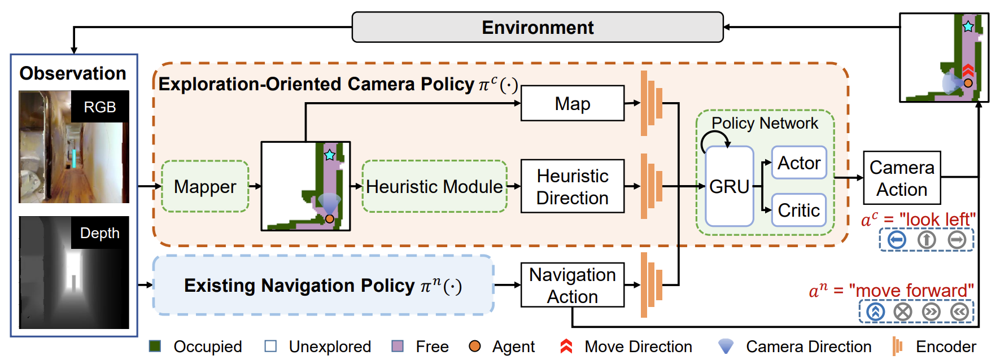

[](https://nips.cc/)
[](https://arxiv.org/abs/2210.07505)
[](https://www.python.org/downloads/release/python-360/)
[](https://github.com/facebookresearch/habitat-lab)

# Learning Active Camera for Multi-Object Navigation
 

This is a PyTorch implementation of our NeurIPS 2022 paper, [Learning Active Camera for Multi-Object Navigation](https://arxiv.org/abs/2210.07505).

<!-- Project Webpage: https://shivanshpatel35.github.io/multi-ON/ -->


## Architecture Overview



## Installing dependencies:

This code is tested on python 3.6.10, pytorch v1.4.0 and CUDA V9.1.85.

Install pytorch from https://pytorch.org/ according to your machine configuration.

This code uses older versions of [habitat-sim](https://github.com/facebookresearch/habitat-sim) and [habitat-lab](https://github.com/facebookresearch/habitat-lab). Install them by running the following commands:

#### Installing habitat-sim:

```
git clone https://github.com/facebookresearch/habitat-sim.git
cd habitat-sim 
git checkout ae6ba1cdc772f7a5dedd31cbf9a5b77f6de3ff0f
pip install -r requirements.txt; 
python setup.py install --headless # (for headless machines with GPU)
python setup.py install # (for machines with display attached)
```

#### Installing habitat-lab:
```
git clone --branch stable https://github.com/facebookresearch/habitat-lab.git
cd habitat-lab
git checkout 676e593b953e2f0530f307bc17b6de66cff2e867
pip install -e .
```

We know that roadblocks can come up while installing Habitat, we are here to help! For installation issues in habitat, feel free to raise an issue in this repository, or in the corresponding habitat repository.


## Setup
Clone the repository and install the requirements:

```
git clone https://github.com/JeremyLinky/activecamera
cd multiON
pip install -r requirements.txt
```

### Downloading data and checkpoints

To evaluate pre-trained models and train new models, you will need to download the MultiON dataset, including objects inserted into the scenes, and model checkpoints. Running `download_multion_data.sh` from the root directory (`multiON/`) will download the data and extract it to appropriate directories. Note that you are still required to download Matterport3D scenes after you run the script (see section on **Download Matterport3D scenes** below). Running the script will download the OracleEgoMap (`oracle-ego`) pre-trained model by default. If you'd like to evaluate other pre-trained models, [see this](docs/downloading_pretrained_models.md).

```
bash download_multion_data.sh
```

#### Download multiON dataset

*You do not need to complete this step if you have successfully run the `download_multion_data.sh` script above.*

Run the following to download multiON dataset and cached oracle occupancy maps:
```
mkdir data 
cd data
mkdir datasets
cd datasets
gdown "https://drive.google.com/uc?id=1YCFk2dvvE2XkdoTmQuDL1VZS5CCk7jTL"
unzip multinav.zip && rm multinav.zip
cd ../
wget -O objects.zip "http://aspis.cmpt.sfu.ca/projects/multion/objects.zip"
unzip objects.zip && rm objects.zip
wget -O default.phys_scene_config.json "http://aspis.cmpt.sfu.ca/projects/multion/default.phys_scene_config.json"
cd ../
mkdir oracle_maps
cd oracle_maps
gdown "https://drive.google.com/uc?id=1g9etTxWlT0LM8RHPllnm8VA8jO_ns_xz"
unzip mp3d_3000.zip && rm mp3d_3000.zip
cd ../
mkdir model_checkpoints
gdown https://drive.google.com/uc?id=19dlIFh0rFf9BeAAjr_5ryo_nk1ds0yI6
```

#### Download Matterport3D scenes

The Matterport scene dataset and multiON dataset should be placed in `data` folder under the root directory (`multiON/`) in the following format:

```
multiON/
  data/
    scene_datasets/
      mp3d/
        1LXtFkjw3qL/
          1LXtFkjw3qL.glb
          1LXtFkjw3qL.navmesh
          ...
    datasets/
      multinav/
        3_ON_same_height/
          train/
            ...
          val/
            val.json.gz
```				

Download Matterport3D data for Habitat by following the instructions mentioned [here](https://github.com/facebookresearch/habitat-api#data).

## Usage

### Pre-trained models

*You do not need to complete this step if you have successfully run the `download_multion_data.sh` script above.* 

```
mkdir model_checkpoints
``` 
Download a pre-trained agent model as shown below.

| Agent            | Run                                                                                                  |
|------------------|:----------------------------------------------------------------------------------------------------:|
| OccAnt           |`gdown https://drive.google.com/uc?id=19dlIFh0rFf9BeAAjr_5ryo_nk1ds0yI6`|
<!-- | ProjNeural       |`wget -O model_checkpoints/ckpt.1.pth "http://aspis.cmpt.sfu.ca/projects/multion/model_checkpoints/ckpt.1.pth"`|
| ObjRecog         |`wget -O model_checkpoints/ckpt.2.pth "http://aspis.cmpt.sfu.ca/projects/multion/model_checkpoints/ckpt.2.pth"`|
| OracleEgoMap     |`wget -O model_checkpoints/ckpt.3.pth "http://aspis.cmpt.sfu.ca/projects/multion/model_checkpoints/ckpt.3.pth"`|
| OracleMap        |`wget -O model_checkpoints/ckpt.4.pth "http://aspis.cmpt.sfu.ca/projects/multion/model_checkpoints/ckpt.4.pth"`| -->


### Evaluation


Evaluation will run on the `3_ON` test set by default. To change this, specify the dataset path [here](https://github.com/saimwani/multiON/blob/main/configs/tasks/multinav_mp3d.yaml#L48).


To evaluate a pretrained OracleEgoMap (`oracle-ego`) agent, run this from the root folder (`multiON/`):

```
python habitat_baselines/run.py \
--exp-config habitat_baselines/config/multinav/ppo_multinav.yaml \
--agent-type oracle-ego \
--run-type eval \
--model-dir /your_path \
EVAL_CKPT_PATH_DIR model_checkpoints/ckpt.16_3691k.pth \
EVAL.USE_CKPT_CONFIG False \
actor_critic.body_AC slam \
actor_critic.camera_AC rl \
camera_policy_inputs '["occ_map", "he_relative_angle", "curr_body_action"]' \
semMap_size 125 \
NUM_PROCESSES 18 \
TORCH_GPU_ID 1 \
SIMULATOR_GPU_IDS [0]  \
TASK_CONFIG.ENVIRONMENT.MAX_EPISODE_STEPS 500
``` 

<!-- For other agent types, the `--agent-type` argument should be changed according to this table:


| Agent         |  Agent type      |
|---------------|------------------|
| NoMap(RNN)    | `no-map`         |
| OracleMap     | `oracle`         |
| OracleEgoMap  | `oracle-ego`     |
| ProjNeuralmap | `proj-neural`    |
| ObjRecogMap   | `obj-recog`      | -->


Average evaluation metrics are printed on the console when evaluation ends. Detailed metrics are placed in `eval/metrics` directory. 

### Training

For training an active camera agent for OccAnt setting, run this from the root directory: 

```
python habitat_baselines/run.py \
--exp-config habitat_baselines/config/multinav/ppo_multinav.yaml \
--agent-type oracle-ego \
--run-type train \
--model-dir result/bodySlam_cameraRL-heReAngle_occMap_currBodyAction-heReward10_turnPenalty1-occMap125 \
TORCH_GPU_ID 0 \
SIMULATOR_GPU_IDS [1,2,3] \
actor_critic.body_AC slam \
actor_critic.camera_AC rl \
NUM_PROCESSES 36 \
camera_policy_inputs '["occ_map", "he_relative_angle", "curr_body_action"]' \
expose_type grown \
RL.HE_RELATIVE_ANGLE_REWARD_SCALE 10.0 \
semMap_size 125 \
RL.TURN_HEAD_PENALTY 1.0
```
<!-- For other setting, the `--agent-type` argument would change accordingly.  -->


## Citation
>Peihao Chen, Dongyu Ji, Kunyang Lin, Weiwen Hu, Wenbing Huang, Thomas H. Li, Mingkui Tan, Chuang Gan, 2022. Learning Active Camera for Multi-Object Navigation in Neural Information Processing Systems (NeurIPS). [PDF](https://arxiv.org/pdf/2210.07505.pdf)

## Bibtex
```
  @inproceedings{chen2022active,
  title={Learning Active Camera for Multi-Object Navigation},
  author={Peihao Chen and
          Dongyu Ji and
          Kunyang Lin and
          Weiwen Hu and
          Wenbing Huang and
          Thomas H. Li and
          Mingkui Tan and
          Chuang Gan},
  booktitle={Neural Information Processing Systems (NeurIPS)},
  year={2022},
}
```

## Acknowledgements
This repository is built upon [Habitat Lab](https://github.com/facebookresearch/habitat-lab).
